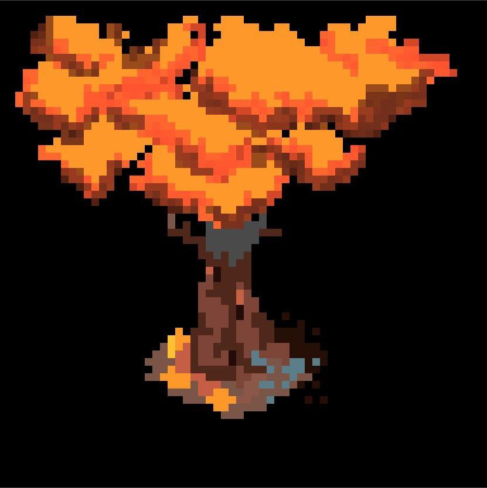

# Pixel-Dust
[](https://app.netlify.com/sites/pixel-dust/deploys)

> ⚠️ An experimental library written from scratch to understand the working of a simple multi-layer art tool

The project started as an exploration and we intend to keep it that way. We do not have any intention to be a me too version of already existing pixel art editors. Feel free to use and modify this library as you like. Below is a drawing made by [Aakash Mallik](https://piperunner.in/) to show what is possible with this library.


## Installation
To use the library you need the base module:
```
npm install @pixel-dust/base
```
This module assumes nothing and hence has been written in pure TS and can thus be used in vanilla code as it is.  
But we do understand that people prefer UI frameworks/libraries these day so we have custom binding for the popular ones.  
For react:
```
npm install @pixel-dust/react
```
**Note**: To use the library in any of the frameworks, you need the binding and the base module. This is anyway mentioned in the peer dependency of the binding.

## Contribution
If you are interested in contributing to this repository, follow the steps to set things up locally.  
We are making use of a [monorepo](https://www.atlassian.com/git/tutorials/monorepos) setup in order to maintain the base library, the bindings and the website.

### 1. NPM Workspaces
We are making use of [workspaces](https://docs.npmjs.com/cli/v7/using-npm/workspaces) in order to manages dependencies and enhance local development ease. In order to make use of **npm workspaces** you need to make sure that npm has a version of **7 or above**.  
If you have a version that satisfies the requirement then there is nothing to be done in this step, else run the following command to get the latest version of npm.
```bash
npm install -g npm@latest
```

### 2. Lerna
We are using lerna for the following:
- Single point command execution for multiple package. (clean, dev, build)
- Publishing
- CI/CD
- Initial bootstrapping is done using lerna which includes installation and local package linking. This is a very important step and needs to be done only once. Subsequent package installations can be done using `npm install` only.

If you don't have lerna installed globally, then you can keep using `npx` to execute it from the registry or from your local installation (whichever it finds first).

Go ahead and execute the following from the project root:
```bash
npm run bootstrap
```
This command will install, link local dependencies and will do an instal build of required packages in order to make sure development bundlers on watch mode end up having the required dependencies as topology is hard to maintain during parallel execution. [#1444](/home/humble_d/.npm/_logs/2021-09-06T19_13_19_598Z-debug.log)
> Note: The project is configured to make use of yarn workspaces, so you can install node modules without worrying too much about hoisting. Also, installing modules in the respective packages is the right way to go as it keeps dependencies explicit.  

### Starting development
Once all the needed packages are installed, all you have to do is run the following from the project root:
```bash
npm run dev
```

## Roadmap
There are a few features we managed to include in the limited time we assigned ourselves and there are a couple more that are left to be done. Some of the features left out are pretty crucial to call it complete in terms of functionality but don't worry, the architecture was planned with this foresight and everything has been documented for contributors to hit the ground running.
- [x] Pencil tool
- [x] Eraser tool
- [ ] Fill tool
- [x] Square draw tool
- [x] Circle draw tool
- [x] Panning
- [x] Zooming
- [x] Exporting output as image file
- [ ] Changing size of tools
- [x] Multi layer drawing support
- [x] Layer rearrangement support
- [ ] Undo/Redo support
- [ ] Resume drawing support 